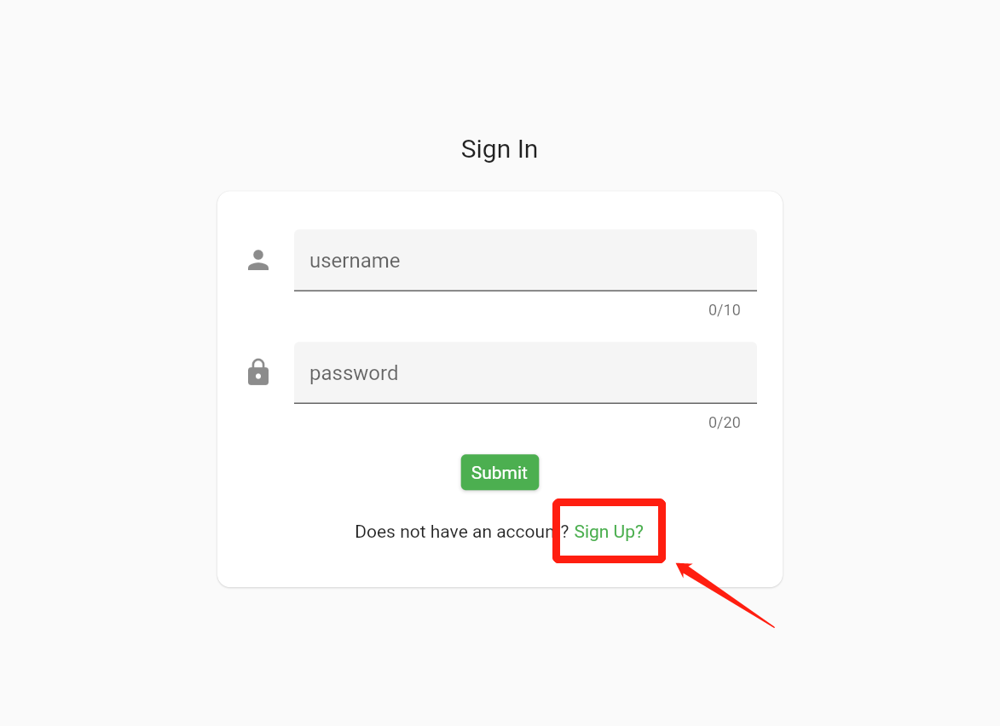
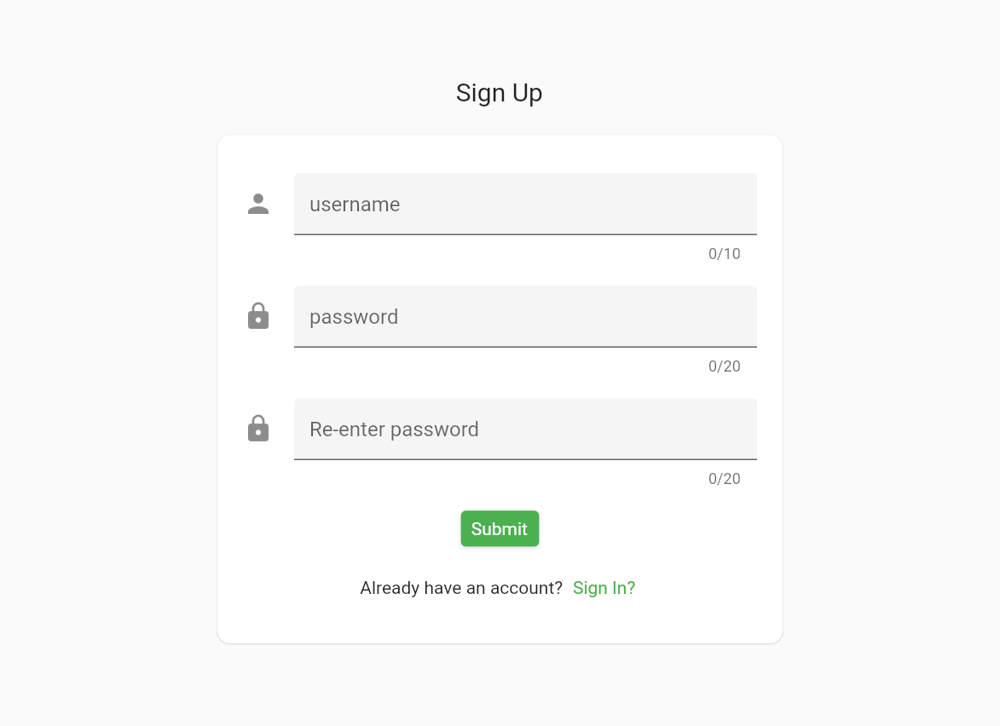
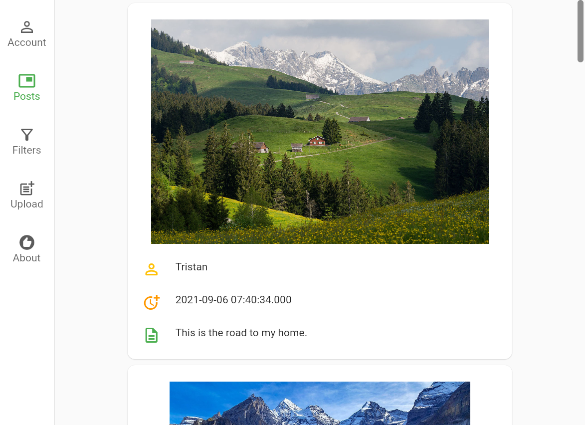
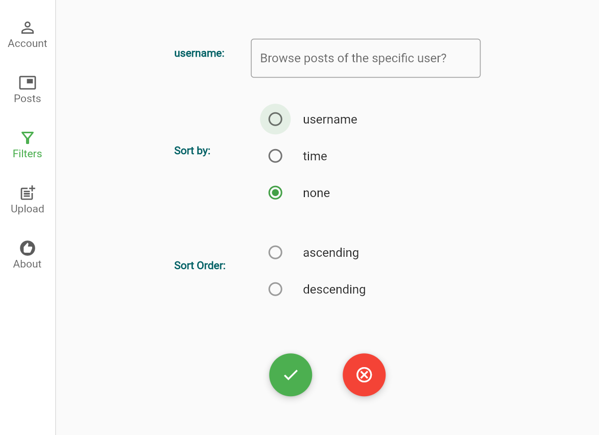
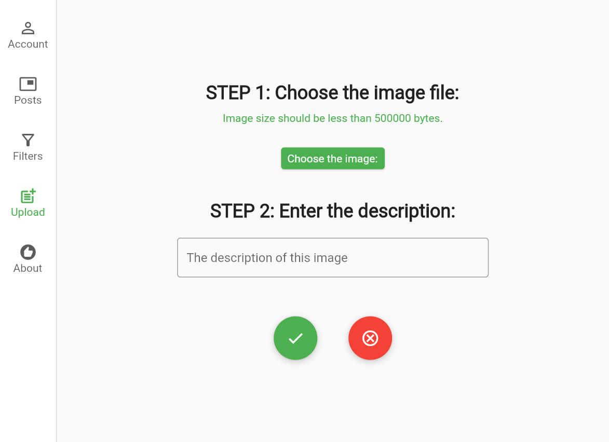

- [1. Overview](#1-overview)
  - [1.1. Technology Stack](#11-technology-stack)
- [UI structure](#ui-structure)
- [2. How to use this repository](#2-how-to-use-this-repository)
- [3. Some technology details](#3-some-technology-details)
  - [3.1. State management](#31-state-management)
  - [3.2. Pagination](#32-pagination)
  - [3.3. Decoupling of UI and the business logic further](#33-decoupling-of-ui-and-the-business-logic-further)
- [4. Test](#4-test)
- [5. License](#5-license)

# 1. Overview
This repository is developed for [the technical assessment](challenge_for_interview.md) of a job interview, and itself is the frontend part of this project. One instance of this repository has been deployed at https://instapic.club/.

The backend of this repository could be found at [another repository](https://github.com/TristanWYL/instapic-backend.git).

## 1.1. Technology Stack
    Flutter

# UI structure

This frontend client supports the following features:

1. Sign in
   


By clicking on the text button red-circled in the screenshot, you will be directed to the sign-up page.

2. Sign up



3. Post browsing



4. Filtering



5. Uploading



# 2. How to use this repository

**STEP 1:** Install [Flutter](https://flutter.dev/docs/get-started/install) and clone this repository

**STEP 2:** Tweak the *lib/misc/config.dart* to suit your case

**STEP 3:** Build the web application with the following command:

    > flutter build web

**STEP 4:** Copy all the content of the build output folder *build/web* to the document root of the deployed web server.

<!-- **STEP 5:** Tweak the *web/index.html* file

Open *web/index.html* with an editor, and change the *href* value of the *base* tag from __/__ to another directoy which suit your case, as appropriate. -->
**STEP 5:** Remember to deploy [the restful backend](https://flutter.dev/docs/get-started/install) as well, for this project to work normally.

**STEP 6:** Surf the web

# 3. Some technology details

## 3.1. State management
In the frontend system, different UI pages need to access to different states. In this repository, the [redux package](https://pub.dev/packages/redux) and [flutter_redux package](https://pub.dev/packages/flutter_redux) are used for the state management.

## 3.2. Pagination
The constructor `builder` of ListView widget is applied for lazily loading and displaying small chunks of pictures. The default page size for each post fetching could be set with variable `PAGE_SIZE` of class `Config` in */lib/misc/config.dart*.

```dart
ListView.builder({
    ScrollController? controller,
    required IndexedWidgetBuilder itemBuilder,
    int? itemCount
  })
```
## 3.3. Decoupling of UI and the business logic further

This project applies `Redux` for the state management, so most business logics are separated from the UI. However, few business logics which are not related to `AppState` but needs to update UI should be carefully treated, so that this few business states are more **testable**. 

For example, when the middleware processes `ActionPromptError`, the logic here should update the UI to prompt the user that some errors are happening. In this case the unit test cannot be carried on for the logic only, as UI is involved. To decouple the logic and the UI, `StreamController` is used by creating an async call for the UI update. If no listener is registered for this Stream, then the UI will not update, even if the logic enqueues an error prompting event. In this case, we could test the logic separatedly and gracefully.

# 4. Test

<!-- ## Unit test -->

Run the following command to start testing:

        flutter test

or if you want to run a single test, try:

        flutter test test/{unit_test}.dart

<!-- ## Integration test

1. Launch the WebDriver

    Refer to [this](https://flutter.dev/docs/cookbook/testing/integration/introduction#6b-web) to download the web driver first, and then launch the web driver.

2. Run the following command for starting the test (assume that the browser is chrome):

        flutter drive --target=test_driver/app.dart --browser-name=chrome --browser-dimension 1280,720 --release -d web-server -->

# 5. License
MIT
